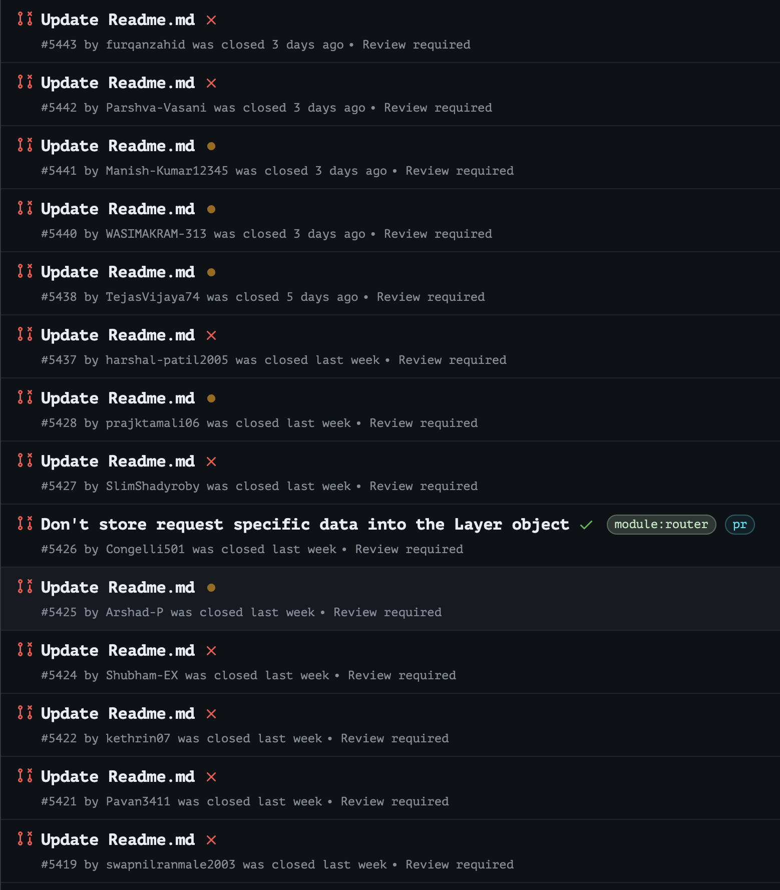

# How Promoting Open-Source Can Become Problematic

If you have been in the open-source community lately, you know what I am talking about. The story goes something like this: There were loads of videos/blogs/events hyping up open-source contributions, mainly as a good gateway to land your dream software engineering job. And to some extent, it is true.

However, this trend has also brought a flood of pull requests (PRs) that contribute little to nothing or, worse, add clutter to the codebase.

And this is why, lately, you can find a wave of blogs and videos on the theme of _“Why you should NOT contribute to Open-Source.”_

This article will show how bad it can get with the latest surge of unsavory PRs.

## Support us

Before we start, we would love it if you starred our [open-source repository](https://github.com/cyclops-ui/cyclops) and help us get our
tool in front of other developers ⭐  
(The irony is not lost on us here... 😄)

## ExpressJS

The latest drama has happened in the [epxressjs GitHub repo](https://github.com/expressjs/express/pulls?q=is:pr+is:closed). As you can see, there were loads of “_Update Readme.md_” pull requests.

This doesn’t immediately sound bad; perhaps the _Readme_ was riddled with typos? It's a long shot, but let's investigate. Unfortunately, that wasn’t the case. Looking closely at some of these PRs, we will see the drama's root cause.

So let us take a look…

Maybe it’s just one bad apple? Well, let’s look at some others…

As you can see, these PRs are not trying to better the project they contribute to. Although somewhat comedic, having lots and lots of such PRs is a nightmare for the project's maintainers.

And the last one, I think, tells the bigger picture in this story. It seems that lots of these PRs were a learning experience (assuming “_Collage”_ was a mistype of “_College”_). Although, that is an assumption made in good faith.

Some of them could have been done as a sort of shortcut for bolstering resumes, which is a far more alarming intent.

## The missing puzzle piece

Newcomers don’t understand that contributing is not all about the code. It is about investing your time in understanding the project and the issues it is trying to solve, being a part of the community and the discussion, and wanting to better the project because you want it to thrive.

And that is what is praised about open source contributions, the will to learn and the will to help. In the process, you demonstrate that you can be proactive and solve complex issues. That is what employers are really looking for.

One look at contributions like these, and you can be sure that you will be ignored by potential employers.

## Final thoughts

Now, there were some external actors in the latest PR nightmare that I won’t be naming here because I doubt that they acted with ill intent. It’s the latest buzz, and I am sure that you can find them with a single Google search if you wanted to.

It’s important to mention that when considering contributing to open-source, start by looking at the projects you already use and are familiar with.

Alternatively, focus on projects where you have domain expertise, as sharing that knowledge can be a valuable resource for the maintainers.

Have you had any bad experiences contributing to open-source?
